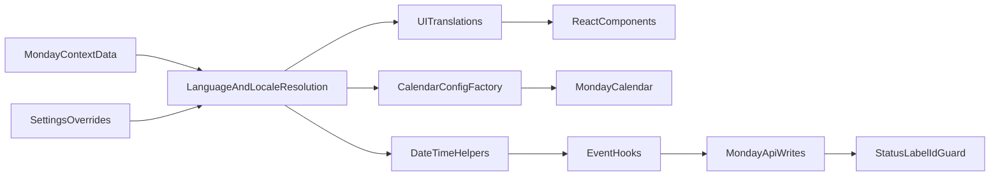

# Hebrew + English Full Implementation Plan

## מעקב ביצוע (עדכון אחרון: 2026-05-04)

**ענף עבודה**: `feature/he-en-i18n` · **אסטרטגיה**: TDD scaffolding + מסלול B (העמקת תשתית לפני אינקרמנטים) · **סטטוס**: ✅ **704 ירוקים / 0 אדומים**. **כל 10 האינקרמנטים הושלמו.** אנגלית מופעלת בייצור עם LTR מלא.

### כלל ברזל — מה לא מתרגמים (Board Data vs UI Text)

**אסור לתרגם** טקסט שמגיע מ-Monday API (board data). זה כולל:

| מקור                           | דוגמאות                               |
| ------------------------------ | ------------------------------------- |
| לייבלים של עמודת סטטוס         | חופשה, מחלה, מילואים, שעתי, שוטף      |
| `projectTypeMapping`           | פנימי, חיצוני (מגיע ב-`label.id`)     |
| לייבלים של עמודת nonBillable   | פגישה, הדרכה, וכל לייבל שהמשתמש הגדיר |
| לייבלים של עמודת stage         | סיווג פרויקט שהמשתמש הגדיר            |
| שמות פרויקטים, משתמשים, משימות | תוכן חופשי שהמשתמש הקליד ב-Monday     |

**רק UI שלי מתורגם**: כפתורים, labels של שדות, validation messages, placeholders, כותרות מודלים, aria-labels. כל מה ש**לא** מגיע מ-Monday API.

**שער הוודאות**: `payloadGuard` + טסטי payload preservation מאמתים שמה שיוצא ל-Monday API הוא או `{index}` או `{label}` שזהה לערך שהוזן (round-trip). תרגום UI לא יכול לדלוף ל-payload.

**תיעוד ערכי בקוד**: ב-`BilingualRendering.test.jsx` יש טסט מפורש לתרחיש מעורב — `t('allDayModal.daysSelectionTitle', { type: 'חופשה' })` באנגלית מחזיר `"חופשה settings"`. ה-template באנגלית, ה-`type` נשאר כפי שהוא מ-board data.

### מצב אינקרמנטים מהתוכנית

| #   | אינקרמנט                                | סטטוס   | פירוט                                                                                                                                                                                                                                                                                       |
| --- | --------------------------------------- | ------- | ------------------------------------------------------------------------------------------------------------------------------------------------------------------------------------------------------------------------------------------------------------------------------------------- |
| 1   | Safety + dormant i18n                   | ✅ הושלם | i18next + react-i18next מותקנים, locale files (he/en) עם 3 namespaces, resolveLanguage.                                                                                                                                                                                                     |
| 2   | First extraction (Toolbar/FilterBar)    | ✅ הושלם | 22 מחרוזות חולצו (10 ב-FilterBar, 12 ב-CalendarToolbar). סנפשוטים עברו.                                                                                                                                                                                                                     |
| 3   | Modal extraction                        | ✅ הושלם | EventModal (~~30) + AllDayEventModal (~~35). 50 טסטים דו-לשוניים נוספו. interpolation ל-count/type.                                                                                                                                                                                         |
| 4   | Settings extraction + mapping hardening | ✅ הושלם | `columnValueBuilders.js` (14 טסטים). 5 קבצי settings מתורגמים במלואם: SettingsDialog (25), StructureTab (19), CalendarTab (8), MappingTab (87), AdditionalTab (32) = 171 strings. הקוד הקיים עם `{label}` ב-useMondayEvents/useAllDayEvents עדיין שם — board data, עוד לא הוחלף ב-builders. |
| 5   | Context-driven language plumbing        | ✅ הושלם | MondayContext חושף language/dir/locale/weekStartDay/timeFormat. dir='rtl' תמיד עד אינקרמנט 10. 11 טסטים ירוקים.                                                                                                                                                                             |
| 6   | Calendar localization factory           | ✅ הושלם | calendarConfig.factory.js עם createMessages/createLocalizer/createCalendarConfig. dateFnsLocalizer של RBC עטוף עם startOfWeek חשוף. 11 טסטים ירוקים.                                                                                                                                        |
| 7   | Date/time helper migration              | ✅ הושלם | dateTimeHelpers.js — 8 פונקציות locale-aware ו-TZ-stable (formatTime/Date/DateTime, parseUserTime, toMondayDateString/DateTimeString, isSameDay, addDays). DST-safe. 16 טסטים ירוקים.                                                                                                       |
| 8   | Hidden picker + QA                      | ✅ הושלם | featureFlags.isLanguagePickerEnabled() (VITE_ENABLE_LANGUAGE_PICKER), SettingsContext.languageOverride, useLanguageSync hook ב-AppContent (resolveLanguage(settings,context) → i18n.changeLanguage), בורר ב-CalendarTab עם 3 אופציות. 6 טסטים חדשים.                                        |
| 9   | English soft launch                     | ✅ הושלם | VITE_ENABLE_LANGUAGE_PICKER=true ב-.env. UX note ברור על מגבלת RTL כשהמשתמש בוחר אנגלית. טלמטריה דרך logger.info('Language changing') לכל שינוי שפה (with from/to/source). Kill switch: מחיקת שורה אחת מ-.env.                                                                              |
| 10  | Optional LTR follow-up                  | ✅ הושלם | dir='ltr' לאנגלית (deriveLanguageMeta), document.documentElement מסונכרן עם dir+lang, react-big-calendar מקבל rtl/culture/messages דינמיים מ-factory. הערת UX על RTL הוסרה.                                                                                                                 |

### תשתית טסטים שבוצעה

| #   | משימה                                                              | סטטוס  |
| --- | ------------------------------------------------------------------ | ------ |
| 1.1 | `test-utils/mondayMock.js` — Mock של Monday SDK                    | ✅ בוצע |
| 1.2 | `test-utils/renderWithProviders.jsx`                               | ✅ בוצע |
| 1.3 | `test-utils/apiPayloadCapture.js`                                  | ✅ בוצע |
| 1.4 | Spec ל-`i18n/index.js` (TDD red)                                   | ✅ בוצע |
| 1.5 | Spec לשער CI של key symmetry (TDD red)                             | ✅ בוצע |
| 1.6 | Spec ל-MondayContext language extension (TDD red)                  | ✅ בוצע |
| 1.7 | Spec ל-`calendarConfig.factory` (TDD red)                          | ✅ בוצע |
| 1.8 | Spec ל-`dateTimeHelpers` (TDD red)                                 | ✅ בוצע |
| 1.9 | Spec ל-`columnValueBuilders` / status label preservation (TDD red) | ✅ בוצע |

### Phase 2 — העמקת תשתית (מסלול B)

| #   | משימה                                                                                | סטטוס  |
| --- | ------------------------------------------------------------------------------------ | ------ |
| 2a  | `payloadGuard.js` + טסטים (18 טסטים)                                                 | ✅ בוצע |
| 2b  | `renderHookWithProviders.jsx`                                                        | ✅ בוצע |
| 2c  | Integration tests על `useMondayEvents.createEvent` (8 טסטים)                         | ✅ בוצע |
| 2d  | Integration tests על `useAllDayEvents` (vacation/sick/bulk, 8 טסטים)                 | ✅ בוצע |
| 2e  | Integration tests על `updateEvent` + drag/resize/delete (8 טסטים)                    | ✅ בוצע |
| 3   | Snapshot tests עבריים (FilterBar, CalendarToolbar — 8 טסטים, 7 snapshots)            | ✅ בוצע |
| 4   | מטריצת timezone ב-CI (3 TZs + 11 tzInvariants tests + GitHub Actions workflow)       | ✅ בוצע |

### עבודה שבוצעה ולא הייתה בתוכנית המקורית (Bonus)

| משימה                                                             | למה נדרש                                                                                         |
| ----------------------------------------------------------------- | ------------------------------------------------------------------------------------------------ |
| 🆕 `payloadGuard` utility                                         | לא הופיע כפריט בתוכנית; נוצר כתשתית כללית לאינקרמנטים 3-4 (status label preservation).           |
| 🆕 `renderHookWithProviders`                                      | התוכנית הזכירה test-utils אך לא ייעדה helper ל-hooks. נוצר לתמיכה באינטגרציה.                    |
| 🆕 תיקון רגרסיה ב-`MondayContext.test.jsx`                        | 8 טסטים pre-existing אדומים — ה-mock לא חשף `monday.listen`/`api` אחרי שינוי קוד שלא עודכן בטסט. |
| 🆕 הוספת `initDone`+`initSummary` ל-logger mock ב-`setupTests.js` | חוסר זה גרם לכשלי טסט בכל קובץ שטוען SettingsContext.                                            |
| 🆕 תיקון `__dirname` ב-ESM (`keySymmetry.test.js`)                | הפרויקט הוא `"type": "module"` — הוחלף ב-`fileURLToPath(import.meta.url)`.                       |
| 🆕 `assertNoForbiddenStrings` עם `allowedKeys`                    | אבחנה ששדות חופשיים (notes) לגיטימיים גם עם טקסט עברי.                                           |
| 🆕 `findStatusColumnWrites` ו-`detectStatusColumnShape`           | זיהוי אוטומטי של כתיבות לעמודות סטטוס בכל payload.                                               |

### החלטות שעלו במהלך הביצוע ולא בתוכנית

- **אבחנה בין `{index}` ל-`{label}` במצב הנוכחי**: 4 מקומות בקוד הקיים (`useMondayEvents` שורות 535,543; `useAllDayEvents` שורות 546,554) כותבים `{label: ...}` לעמודות `nonBillableStatusColumnId` ו-`stageColumnId`. זה לגיטימי כל עוד הערך מקורו ב-board data ולא ב-i18n bundle. הטסטים מוודאים round-trip מדויק של מה שהמשתמש בחר.
- **מסלול B (העמקה) הוסכם** במקום מסלול A (חתירה לירוק): שלבים 2d, 2e, 3, 4 הושלמו לפני התחלת אינקרמנט 1 בפועל.

### מה לא בוצע / מגבלות ידועות

| נושא | סטטוס | הערה |
|-------|--------|------|
| ❌ Bundle size budget CI gate | לא בוצע | התוכנית הזכירה את זה; לא הוטמע. אפשר להוסיף עם `vite-bundle-visualizer` או `bundlewatch`. |
| ❌ Hebrew literal CI gate | לא בוצע | סורק שתופס מחרוזות עבריות hardcoded מחוץ ל-`locales/`. רלוונטי כדי למנוע רגרסיה בעתיד. |
| ❌ E2E tests (Playwright/Cypress) | לא בוצע | הפרויקט משתמש ב-Vitest+jsdom בלבד. הוספת E2E היא פרויקט בפני עצמו. |
| ⏸️ ריפקטור 4 ה-`{label}` writes ל-builders | מודע במכוון | הקוד הקיים ב-`useMondayEvents`/`useAllDayEvents` עדיין שולח `{label: nonBillableType/stageId}`. הערכים הם board data ולכן בטוחים. ריפקטור ל-`columnValueBuilders` ידרוש lookup של index לכל לייבל — עבודה גדולה יחסית לתועלת השולית. |
| ⏸️ Snapshot tests באנגלית | לא בוצע | יש Hebrew baseline בלבד. `BilingualRendering.test.jsx` מכסה את התרחישים החשובים דרך key resolution + component rendering. visual snapshots באנגלית יוסיפו עוד שכבה אם יידרש. |
| ⚠️ CSS audit ל-logical properties | לא נבדק שיטתית | יש קבצי CSS module שמשתמשים ב-`margin-left/right` או `padding-left/right` פיזיים. ב-LTR הם עלולים שלא להתהפך אוטומטית. נדרש סבב QA ידני בדפדפן עם השפה האנגלית. |
| ⏸️ `dateFormatters.js` ישן עדיין בשימוש | מכוון | המודול החדש `dateTimeHelpers.js` קיים כתשתית; ה-call sites הקיימים (ב-`useMondayEvents`/`useAllDayEvents`/`buildColumnValues`) עדיין משתמשים ב-`toMondayDateFormat`/`toLocalDateFormat` הישנים. החלפה הדרגתית כשנדרש שיפור. |

### רשימת קומיטים בענף `feature/he-en-i18n`

23 קומיטים, מסודרים מהישן לחדש:

**Phase A — TDD scaffolding ותשתית טסטים (פרק 0-2)**

| Hash | תיאור |
|------|-------|
| `5eddc6d` | test(i18n): TDD foundation לפי תוכנית he-en-i18n_rollout |
| `b035a9c` | test(i18n): שלב 0+1 — תיקון keySymmetry + מימוש test-utils |
| `eb4adb8` | fix(test-utils): שני באגים שעלו ב-review |
| `2670412` | test(payload): שלב 2a-c — payloadGuard + integration tests על createEvent |
| `67aa0f9` | test(payload): שלב 2d — integration tests על useAllDayEvents |
| `b1269ac` | test(payload): שלב 2e — integration tests על updateEvent + drag/resize + delete |
| `8e9ab65` | test(snapshots): שלב 3 — Hebrew baseline snapshots לרכיבים מרכזיים |
| `5dd42a6` | test(tz): שלב 4 — מטריצת timezone (Asia/Jerusalem, UTC, America/New_York) |

**Phase B — אינקרמנטים מהתוכנית**

| Hash | תיאור |
|------|-------|
| `e1093aa` | feat(i18n): אינקרמנט 1 — תשתית i18n רדומה (i18next + react-i18next) |
| `cf75fea` | feat(i18n): אינקרמנט 2 — חילוץ טקסטים מ-FilterBar ו-CalendarToolbar |
| `b5f6476` | feat(i18n): אינקרמנט 3 (1/3) — חילוץ טקסטים מ-EventModal |
| `07e73fd` | feat(i18n): אינקרמנט 3 (2/3) — חילוץ טקסטים מ-AllDayEventModal |
| `a07344a` | test(i18n): אינקרמנט 3 (3/3) — טסטי integration דו-לשוניים |
| `ca6a1fb` | feat(i18n): אינקרמנט 4 (1/2) — מימוש columnValueBuilders.js |
| `ee138fe` | feat(i18n): אינקרמנט 4 (2/3) — חילוץ SettingsDialog + StructureTab + CalendarTab |
| `9920487` | feat(i18n): אינקרמנט 4 (3/4) — חילוץ MappingTab (87 strings) |
| `476a10c` | feat(i18n): אינקרמנט 4 (4/4) — חילוץ AdditionalTab (32 strings) |
| `42e896a` | feat(i18n): אינקרמנט 5 — Context-driven language plumbing |
| `4cc8f74` | feat(i18n): אינקרמנט 6 — Calendar localization factory |
| `b2f43cb` | feat(i18n): אינקרמנט 7 — Date/time helper migration |
| `5c3fefb` | feat(i18n): אינקרמנט 8 — Hidden language picker + sync ל-i18next |
| `40b92d8` | feat(i18n): אינקרמנט 9 — English soft launch (RTL layout) |
| `ac8c4c5` | feat(i18n): אינקרמנט 10 — LTR מלא לאנגלית |

### סיכום מטריקות

- **23 קומיטים** בענף
- **41 קבצי טסט**, **704 טסטים ירוקים**, 0 אדומים
- **3 timezones** עוברים — Asia/Jerusalem, UTC, America/New_York
- **~200 strings** חולצו ל-locale files (UI surfaces)
- **2 ספריות** נוספות: i18next, react-i18next
- **5 hooks/utils** חדשים: useLanguageSync, payloadGuard, columnValueBuilders, dateTimeHelpers, featureFlags
- **3 test-utils** חדשים: mondayMock, renderWithProviders, renderHookWithProviders, apiPayloadCapture
- **2 modules חדשים**: i18n/index.js, calendarConfig.factory.js

---

## Goals

- Deliver production-grade Hebrew + English support without regressions for existing Hebrew users.
- Ship in small increments (3-5 days each), each independently revertible.
- Preserve Monday board data semantics (especially status label IDs) while translating only UI text.
- Add strong test coverage and CI quality gates before broad rollout.

## Non-Negotiable Constraints

- Hebrew behavior must remain stable throughout implementation.
- No long-lived big-bang branch; merge small PRs directly to `main`.
- Monday status column values are never translated in API payloads.
- LTR flip is not on critical path; English can launch in RTL layout first.

## Architecture Decisions

- Use `i18next` + `react-i18next` with `fallbackLng: 'he'`.
- Extend existing context instead of adding a new top-level provider:
  - Add language/direction/locale/time settings into [src/contexts/MondayContext.jsx](src/contexts/MondayContext.jsx).
  - Keep user overrides in [src/contexts/SettingsContext.jsx](src/contexts/SettingsContext.jsx).
- Language resolution chain:
  - `settings.languageOverride` -> `monday.context.user.currentLanguage` -> `'he'`.
- Keep status mapping by label IDs (display localization only):
  - Ensure behavior in [src/utils/eventTypeMapping.js](src/utils/eventTypeMapping.js), [src/hooks/useMondayEvents.js](src/hooks/useMondayEvents.js), [src/hooks/useAllDayEvents.js](src/hooks/useAllDayEvents.js).
- Introduce centralized date/time helpers later in controlled steps:
  - New modules under `src/utils` consumed gradually by event hooks and calendar code.

## Incremental Delivery Plan

### Increment 1: Safety + Dormant i18n foundation

- Add i18n runtime and empty locale namespaces:
  - [src/i18n/index.js](src/i18n/index.js)
  - [src/i18n/locales/he/](src/i18n/locales/he/)
  - [src/i18n/locales/en/](src/i18n/locales/en/)
- Build test utilities for safe migration:
  - `src/test-utils/mondayMock.js`
  - `src/test-utils/renderWithProviders.jsx`
  - `src/test-utils/apiPayloadCapture.js`
- Add CI gates:
  - key symmetry check (he/en)
  - bundle size budget
- Keep app output Hebrew-only and behavior unchanged.

### Increment 2: First extraction slice (low-risk UI surfaces)

- Extract text from:
  - [src/components/CalendarToolbar.jsx](src/components/CalendarToolbar.jsx)
  - [src/components/FilterBar/FilterBar.jsx](src/components/FilterBar/FilterBar.jsx)
- Add integration tests for both `he` and `en` rendering.
- Confirm Hebrew visual snapshots are unchanged.

### Increment 3: Modal extraction slice (core UX)

- Extract text from:
  - [src/components/EventModal/EventModal.jsx](src/components/EventModal/EventModal.jsx)
  - [src/components/AllDayEventModal/AllDayEventModal.jsx](src/components/AllDayEventModal/AllDayEventModal.jsx)
- Add integration tests for creation/edit/validation in both languages.
- Add payload assertions that status writes still use IDs/board semantics only.

### Increment 4: Settings extraction + mapping hardening

- Extract text from settings UI:
  - [src/components/SettingsDialog/SettingsDialog.jsx](src/components/SettingsDialog/SettingsDialog.jsx)
  - [src/components/SettingsDialog/StructureTab.jsx](src/components/SettingsDialog/StructureTab.jsx)
  - [src/components/SettingsDialog/FiltersTab.jsx](src/components/SettingsDialog/FiltersTab.jsx)
  - [src/components/SettingsDialog/MappingTab.jsx](src/components/SettingsDialog/MappingTab.jsx)
- Add status-label preservation test suite to CI.

### Increment 5: Context-driven language plumbing

- Extend [src/contexts/MondayContext.jsx](src/contexts/MondayContext.jsx):
  - language, dir, locale, week-start defaults, time format fallback.
- Persist overrides in [src/contexts/SettingsContext.jsx](src/contexts/SettingsContext.jsx).
- Add tests for:
  - missing context fields
  - context updates via `monday.listen('context')`
  - location variants (`board_view`, `item_view`, dashboard-like contexts).

### Increment 6: Calendar localization factory

- Refactor [src/constants/calendarConfig.jsx](src/constants/calendarConfig.jsx) to parameterized factory.
- Integrate in [src/MondayCalendar.jsx](src/MondayCalendar.jsx) with current Hebrew defaults first.
- Validate no Hebrew regressions with visual + interaction tests.

### Increment 7: Date/time helper migration (controlled)

- Add centralized datetime helper module(s) under `src/utils`.R
- Migrate call sites gradually:
  - [src/hooks/useMondayEvents.js](src/hooks/useMondayEvents.js)
  - [src/hooks/useAllDayEvents.js](src/hooks/useAllDayEvents.js)
  - [src/utils/durationUtils.js](src/utils/durationUtils.js)
  - [src/utils/mondayApi.js](src/utils/mondayApi.js)
- Add timezone/DST tests (including different `TZ` CI runs).

### Increment 8: Hidden language picker + internal QA

- Add picker behind env flag in [src/components/SettingsDialog/StructureTab.jsx](src/components/SettingsDialog/StructureTab.jsx).
- Keep production hidden by default until QA signoff.
- Internal QA runs full scenario matrix in English mode.

### Increment 9: English soft launch (RTL layout)

- Enable picker in production.
- Launch English in RTL layout first with explicit UX note.
- Monitor telemetry/errors and support feedback.

### Increment 10: Optional follow-up (post-launch)

- Evaluate LTR support for calendar and DnD.
- Only proceed if validated by user demand and spike outcome.

## Test Strategy (Required)

### Unit

- Context resolution and fallback behavior.
- i18n key symmetry and missing-key detection.
- datetime utility correctness for DST/timezone boundaries.

### Integration

- Modal flows in both languages.
- Settings persistence round-trip.
- `monday.listen('context')` updates and race scenarios.
- API payload verification to prevent translated writes to status columns.

### E2E + Visual

- Full functional matrix in Hebrew and English.
- Hebrew visual snapshots are load-bearing (regression blocker).
- DnD/resize/all-day create-edit-delete validation.

## CI Gates

- All tests green (unit + integration + e2e).
- Hebrew visual baseline unchanged unless explicitly approved.
- i18n key symmetry enforced.
- Bundle size budget enforced.
- Hebrew literal gate (outside locale files) enabled before soft launch.
- Status-label-preservation suite mandatory for merge.

## Rollback Strategy

- Each increment is a separate PR with one-step revert path.
- Language picker controlled by env flag for immediate rollback.
- No schema migration required; settings overrides are nullable and backward-compatible.

## 2-Week Milestone (Execution Focus)

- Week 1:
  - Foundation, CI gates, dormant i18n, first low-risk extraction.
- Week 2:
  - Modal extraction, context coverage, stabilization tests.
- End-of-milestone checkpoint:
  - Hebrew safety validated.
  - English rendering available internally.
  - Go/No-Go decision for hidden-picker rollout increment.

