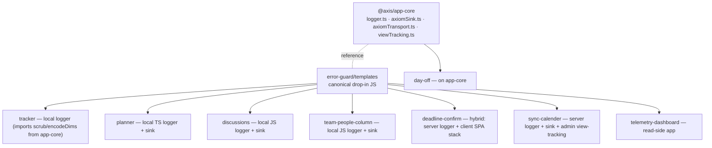

# Logging & Telemetry Architecture (Axiom v2)

> The definitive architecture reference for the client- and server-side logging /
> telemetry pipeline used by every app in this monorepo. For the normative
> *contract* (goal, activation gate, one-time setup, enforcement) see
> [`ERROR-AXIOM-STANDARD.md`](./ERROR-AXIOM-STANDARD.md); this document explains
> **how the system is built** and **why**.

---

## 1. Purpose & scope

Every client (browser) and server (monday-code / Node) app in this repo ships
structured telemetry to **one shared Axiom dataset, `app-errors`**, over a single
hardened pipeline. Three kinds of signal travel the same rails:

| `kind` | what it is | how it is produced |
|--------|-----------|--------------------|
| `error` | errors & warnings worth investigating | `logger.error` / `logger.warn` / `logger.apiError` |
| `usage` | product usage (which views/actions, per account) | auto **view-tracking** + explicit `logger.track()` |
| `health` | operational health (boot success, API latency) | `logger.health()` |

The design is **privacy-first, fail-soft, and inert-by-default**: nothing ships
unless a build/deploy has an activation token baked in, and even then a strict
allowlist + scrubber guarantees no PII or secrets leave the client.

The pipeline exists in three shapes, all implementing the same contract:

- **`@axis/app-core`** — the shared TypeScript implementation (`apps/axis/services/app-core`), consumed by app-core apps.
- **error-guard skill templates** — the canonical drop-in JS implementation (`.claude/skills/error-guard/templates/`) that local-logger apps are generalized from.
- **per-app local copies** — apps deliberately off app-core (test-locked suites) carry their own logger/sink, kept contract-compatible with the templates.

---

## 2. Design goals & principles

1. **One dataset, discriminated in-band.** All apps + all signal kinds land in `app-errors`, separated by the `app` field (which app) and the `kind` field (error/usage/health). No per-app or per-kind dataset sprawl.
2. **Privacy is structural, not incidental.** The transport ships **only** an exact-key allowlist. Free-form payloads (`record.data`, GraphQL query/variables/response, Hebrew user messages) are *never* copied. `error.message` ships **only** scrubbed, as `err_msg`.
3. **Fail-soft everywhere.** `enqueue`/`flush` never throw to the caller; a broken sink or transport degrades to a one-line console breadcrumb and a permanent no-op — the app never pays for telemetry.
4. **Inert until explicitly activated.** In dev, tunnel, and tests the transport is a structurally inert handle; usage/health records still flow through the logger's ring buffer but ship nowhere.
5. **Backward-compatible additive rollout.** Ordinary WARN/ERROR shipping stayed byte-identical while `usage`/`health` were added; per-app logger signatures were preserved.
6. **Single source of truth for the wire format.** `scrubMessage` and `encodeDims` are byte-identical across app-core, the templates, and every local copy — divergence is a defect.

---

## 3. High-level data flow

```mermaid
flowchart LR
  subgraph App["App code"]
    call["logger.error / warn / apiError<br/>logger.track (usage)<br/>logger.health<br/>useViewTracking"]
  end
  call --> logger["logger — single emit() choke-point<br/>ring buffer · log-once dedup · sinks"]
  logger -->|console| console[("dev console")]
  logger -->|fan-out| uisink["UI error sink<br/>toasts / boundary"]
  logger -->|fan-out| axsink["Axiom sink<br/>shouldShip → mapRecordToEvent"]
  axsink -->|"enqueue flat event"| transport["transport<br/>sanitize · dedup · batch · breaker"]
  transport -->|"HTTPS batch"| axiom[("Axiom dataset<br/>app-errors")]
  axiom --> dash["telemetry-dashboard<br/>access-controlled monday-code app"]
```

The **logger** is the one choke-point every log passes through. It fans out to
*sinks* (the Axiom sink, the UI error sink, any test sink). The **Axiom sink** is
the bridge that decides *whether* a record ships (`shouldShip`) and *maps* it to a
flat wire event (`mapRecordToEvent`). The **transport** owns the network: exact-key
sanitizing, dedup, batching, a circuit breaker, and a session cap. Read side: the
**dashboard** queries `app-errors` server-side.

---

## 4. Pipeline components

### 4.1 Logger (`logger.js` / `logger.ts`)

A dependency-free leveled logger with:

- **`emit(record)` — the single choke-point.** Every public method builds a structured `LogRecord` and routes it here. `emit` normalizes timestamps, applies **log-once dedup**, runs an optional `beforeSend` transform, renders to the console (gated by level), pushes to a **ring buffer** (cap 150), and fans out to registered sinks.
- **Log-once dedup.** The same `Error` instance is stamped with a non-enumerable `__loggedId`; a second pass is flagged `duplicate:true` and withheld from sinks (one error = one shipped record), while `correlationId` links the duplicates.
- **Sink registry.** `addSink(fn) → unsubscribe`; sinks each run in their own `try/catch` so a failing sink can never throw back into `emit` or recurse.
- **v2 telemetry methods:**
  - `track(event, dims)` → INFO record, `domainKind:'usage'`, `alwaysShip:true`, message = `encodeDims(event, dims)`.
  - `health(signal, metrics)` → INFO record, `domainKind:'health'`, `alwaysShip:true`, message = `encodeDims(signal, metrics)`.
  - `encodeDims(base, dims)` folds categorical/measured dims into a stable, APL-parseable message suffix — `base k1=v1 k2=v2` with keys **sorted**, keeping only `string | boolean | finite-number` values.

> **The rendering-kind vs domain-kind distinction (load-bearing).** Some local
> loggers use `record.kind` for *console rendering* (`simple`/`error`/`api`/…). The
> Axiom **domain** discriminator (`error`/`usage`/`health`) therefore travels on a
> separate field, `record.domainKind`, and the sink reconciles it:
> `ev.kind = record.domainKind ?? 'error'`. A rendering kind is **never** shipped.

### 4.2 Axiom sink (`axiomErrorSink.js` / `errors/axiomSink.ts`)

The bridge from logger records to the transport. Pure, unit-testable seams:

- **`shouldShip(record, remoteLevel)`** — order is contractual:
  1. `!record` → `false`
  2. `record.duplicate === true` → `false` (duplicates never ship)
  3. `record.alwaysShip === true` → `true` (usage/health bypass the level policy)
  4. incident override (`remoteLevel`) → ship iff `rank(level) ≥ rank(remoteLevel)`
  5. default policy → only `WARN`/`ERROR` ship
- **`mapRecordToEvent(record)`** — maps **exactly** the allowlisted fields; sets `ev.kind = domainKind ?? 'error'`; ships `error.message` **only** via `scrubMessage` as `err_msg`; extracts `err_name`, `err_code` (`errorCode ?? status ?? code`), and the first stack frame `stack1`; and copies only the finite-number context timings `ms`/`total_ms`/`step`. It **never** reads `record.data` or `context.query|variables|response|rawResponse`.
- **`attachAxiomSink()`** — constructs the transport (once, HMR/StrictMode-guarded via a `globalThis` flag set *before* replay), replays the import-time ring buffer, then registers the live sink. Returns an unsubscribe.
- **`setAxiomContext({accountId,userId,boardId,instanceId})`** — merges monday iframe identity (`acc`/`usr`/`obj`/`board`) into every future envelope; undefined never clobbers.

### 4.3 Browser transport (`axiomBrowserTransport.js` / `axiomTransport.ts`)

The network layer — no React, no `import.meta` (env is injected by the sink). See §8 for internals. Public API: `enqueue(event)` (never throws), `setContext(ctx)`, `flush(reason)`, `stats()`, `dispose()`.

### 4.4 Server sink (`server/axiomServerSink.js`)

The Node/monday-code equivalent. Ships via `@axiomhq/js` (background batching + `flush()` on shutdown). Same `scrubMessage` + `err_msg`, same `ev.kind = domainKind ?? 'error'`, same `shouldShip` ordering. Differences from the browser:

- `firstStackFrame` is **V8-only** (`/^\s*at /`) — Node never produces the Firefox `name@url` frame the browser guards against.
- Context filtering uses a **`CTX_ALLOW` allowlist** (short ids/enums/counters) rather than the transport's exact-key allowlist.
- Envelope enrichment (`ver`, `sess`) is stamped by the sink (there is no separate transport).

### 4.5 View-tracking (`viewTracking.js` / `usage/viewTracking.ts`)

`createViewTracker(logger)` keeps a per-session `seen` Set; `useViewTracking(logger, view, dims)` is a thin React hook keyed on a **module-level `WeakMap<logger, tracker>`**, so a `view_open` usage event fires **at most once per view per session** across every component/mount — StrictMode-double-mount safe. `dims` are read through a ref so the effect depends only on `[logger, view]` (no `exhaustive-deps` disable, portable across app ESLint configs).

---

## 5. The wire contract — the `app-errors` envelope

Every shipped event is a **flat** object of strings + finite numbers. The browser
transport enforces an **exact-key allowlist** (everything else is dropped); the
server sink builds the same shape directly.

| field | source | notes |
|-------|--------|-------|
| `_time` | transport (enqueue) / sink | ISO timestamp |
| `app` | transport static | the app slug — the shared-dataset discriminator |
| `env`, `ver`, `sess` | transport/sink static | environment, app version (+build SHA), per-page/process session id |
| `acc`, `usr`, `obj`, `board` | `setAxiomContext` | monday identity (account/user/instance/board) |
| `level` | record | `debug`/`info`/`warn`/`error` |
| `tag` | record.module | the module/category |
| `message` | record.message | **stable English event id** (usage/health fold dims in via `encodeDims`); cap 300 |
| `kind` | `domainKind ?? 'error'` | **domain** discriminator: `error`/`usage`/`health`; cap 32 |
| `corr` | record.correlationId | links duplicates of one error |
| `err_name`, `err_code` | error | error class + `errorCode`/`status`/`code` |
| `err_msg` | `scrubMessage(error.message)` | **the only path for `error.message` — always scrubbed**, cap 200 |
| `stack1` | first stack frame | cap 400; minified — symbolicate via hidden CI sourcemaps (§6) |
| `ms`, `total_ms`, `step` | context (finite numbers) | timings |

`message` is intentionally a **stable event id**, not free text — usage/health
encode their dimensions into it (`view_open view=gantt`, `api_latency bucket=fast ok=true`,
`boot ms=1200`) so Axiom/APL can group on it. Raw error text never belongs in
`message`; call sites pass the error as the error arg so it flows to `err_msg`.

---

## 6. Privacy & security model (the core)

This is the load-bearing part of the design. Five layers of defense:

1. **`scrubMessage` (D2).** The *only* function allowed to place `error.message` on the wire. Redacts, in order: **emails first** (`[email]`), then **long token/hex runs ≥16** (`[redacted]`), then **digit-runs ≥7** (`[num]`). Pre-capped at 1000 chars (bounds regex work), final slice 200. Byte-identical across app-core, templates, and every app.
2. **`err_msg`-only.** The sink assigns `error.message` to exactly one field — `err_msg` — and only through `scrubMessage`. The raw message is never handed to `message`, `data`, or any other field.
3. **Anchored `firstStackFrame` (browser).** After V8 `/^\s*at /` frames, the fallback matches a *real* Firefox/Safari frame with an **anchored** regex `/^\s*\S*@\S+:\d+(?::\d+)?\s*$/` (no whitespace before `@`). A prose message containing an email (`Error: mail admin@x.co bounced`) has whitespace before `@` and can never be mistaken for a frame — so an email in `error.message` can't leak into `stack1`.
4. **Exact-key allowlist (transport).** The browser transport's sanitizer applies one precedence rule per key: exact-key allowlist wins (`String(v).slice(0, cap)`); transport-owned keys dropped; a **deny-substring** (`name|title|summary|text|label|email|token|secret|password`) drops everything else regardless of type; remaining **finite-number** keys pass (≤12 numeric extras); all else drops. Output is on a null-prototype object. The server sink uses the analogous **`CTX_ALLOW`** allowlist for context fields.
5. **Inert activation gate.** The client ships only when `import.meta.env.PROD === true` **and** `VITE_AXIOM_DATASET` + `VITE_AXIOM_TOKEN` + `VITE_AXIOM_APP` are baked into the bundle; otherwise the transport is an inert handle and `attachAxiomSink()` is a no-op. The server ships only when `AXIOM_TOKEN` + `AXIOM_DATASET` + `AXIOM_APP_NAME` are set in the platform env. **Nothing ships in dev/tunnel/tests.**

> Access-log hygiene: server request/response helpers log `req.path` (not
> `req.originalUrl`) so query-string tokens/emails never reach the `url` field.

### Stack symbolication (hidden sourcemaps)

`stack1` ships **minified** (`at Sl (…/assets/index-Brz8XzEh.js:61:29212)`) — a
single frame, on the same privacy budget as the rest of the wire. To turn that
back into `GroupColors.jsx:42` **without** fattening the wire or exposing source
publicly, symbolication happens **off the wire, at read time**:

1. **Client builds emit `sourcemap: 'hidden'`** (Vite `build.sourcemap`). This
   writes `build/assets/*.js.map` but omits the `//# sourceMappingURL=` comment,
   so a browser never fetches a map and the deployed JS is byte-for-byte unchanged.
2. **CI archives the maps, never ships them.** Each client app's deploy workflow,
   *between Build and `mapps code:push`*, uploads `build/**/*.map` as the artifact
   **`sourcemaps-<app>-<github.sha>`** (90-day retention) and then **deletes every
   `.map` from the deploy dir** — with a hard assertion that none remain, so a
   sourcemap can never reach the CDN. The wire stays a lean single frame; the maps
   live only in GitHub Actions artifacts, gated by repo access.
3. **Resolve on demand** with the axiom-sre tool, keyed by the log row's `ver`
   (`<pkgVersion>+<shortSha>`), which matches the artifact's SHA:
   ```bash
   .claude/skills/axiom-sre/scripts/symbolicate \
     'at Sl (…/assets/index-Brz8XzEh.js:61:29212)' --app discussions --ver 2.3.0+9292e7a
   # → src/…/GroupColors.jsx:42:10  (loadGroupColors)  + source snippet
   ```
   Offline / a locally-built map: pass `--map <path/to.js.map>` instead.

This keeps all five privacy layers intact — maps are never public, the wire is
unchanged — while making minified frames investigable. Enabled per client app
(one-app-per-PR); server apps already build `sourcemap: true` but do not deploy
to a public CDN, so their maps are not a leak vector.

---

## 7. Transport internals (browser)

The transport is a small, self-contained state machine tuned for a keepalive-safe,
at-most-once shipper. Default caps:

| cap | value | purpose |
|-----|-------|---------|
| `batchMaxEvents` / `batchMaxBytes` | 20 / 60 KB | batch size (keepalive 64 KB headroom) |
| `flushIntervalMs` | 5 000 | timer flush |
| `queueMax` | 100 | bounded queue, **drop-oldest** |
| `dedupWindowMs` / `dedupMaxPerWindow` | 60 000 / 5 | collapse repeats keyed `level\|tag\|message` |
| `sessionShipMax` | 300 | per-page ship cap (then one `events_dropped` meta) |
| `breakerFailureThreshold` / `breakerOpenMs` | 3 / 60 000 | circuit breaker |
| `messageMaxLen` / `stackMaxLen` / `fieldMaxLen` | 300 / 400 / 128 | field caps |

- **Enqueue pipeline:** `disposed→drop · sanitize + stamp _time · dedup (fixed window, transport-tag bypass, bounded 500-key map) · session cap · queue cap drop-oldest · schedule`.
- **Dedup depends on a stable message** — this is why `api_latency` health ships a coarse **bucket** (`fast/ok/slow/very_slow`), not raw `ms`: a per-call unique message would defeat dedup and burn the session cap, starving real errors.
- **Flush paths:** timer (5 s), size (≥20 queued → immediate), and **hidden** (`visibilitychange`/`pagehide` → one keepalive POST of the newest events). Routine drains chain follow-up POSTs; the hidden path cuts one batch synchronously so it's never starved.
- **Circuit breaker:** 3 consecutive failures → open 60 s (zero fetch) → half-open probe → closed (emits one `transport_recovered` meta). At-most-once: failed batches are discarded, never re-queued.
- **HMR/StrictMode idempotency:** a dispose-and-replace registry keyed by `options.app` guarantees a single live transport per app.

---

## 8. Configuration & activation

| where | vars | set by |
|-------|------|--------|
| **Client build** (Vite) | `VITE_AXIOM_DATASET=app-errors`, `VITE_AXIOM_TOKEN=${{ secrets.AXIOM_INGEST_TOKEN }}`, `VITE_AXIOM_APP=<slug>` | the app's deploy workflow (CI), baked into the bundle |
| **Server runtime** (monday-code) | `AXIOM_TOKEN`, `AXIOM_DATASET=app-errors`, `AXIOM_APP_NAME=<slug>` | `mapps code:env` (**user-only**, never committed) |
| **Ingest token** | GH secret `AXIOM_INGEST_TOKEN` (write-only) | `gh secret set` (**user-only**) |
| **Incident mode** | `window.setRemoteLevel('DEBUG')` (client, persists via localStorage) / `LOG_SHIP_LEVEL` env (server) | operator, at runtime |

Tokens are **USER-ONLY** — agents never read or write them. The ingest token is
write-only; the dashboard's read token (`AXIOM_QUERY_TOKEN`) is a separate secret.

---

## 9. Per-app topology



| app | shape | logging |
|-----|-------|---------|
| **day-off** | client, on `@axis/app-core` | inherits track/health/view-tracking |
| **tracker** | client, local logger | v2 local logger; imports `scrubMessage`/`encodeDims` from app-core |
| **planner** | client (TS), local | local TS logger + sink + transport |
| **discussions** | client (JS), local | local JS logger + sink + transport |
| **team-people-column** | client (JS), local | local JS logger + sink + transport |
| **deadline-confirm** | hybrid (Express + admin SPA) | server logger + sink **and** a client SPA stack |
| **sync-calender** | server (Express) + admin | server logger + sink; admin view-tracking |
| **telemetry-dashboard** | read side | server queries Axiom; no ingest |

Each app added the same call-site baseline: **auto view-tracking** on its main
views, a **one-shot boot `health`**, and a **bucketed `api_latency` health** at the
single API funnel.

---

## 10. The error-guard skill (governance)

The pipeline is owned by the **error-guard** skill at `.claude/skills/error-guard/`:

- **Templates** (`templates/`) are the **canonical** drop-in implementation. `monday-scaffold` (client) and `integration-scaffold` (server) hold **synced copies** that differ from canonical by only a one-line `// SYNCED COPY` banner — fix canonical, then re-sync (banner-preserving). A byte-identical non-git mirror also lives in the pre-monorepo apps dir.
- **Enforcement** (`scripts/check.sh` + `scripts/audit.sh`) runs a minimal ESLint rule kit (catch-must-log, no-console, promise handling) as a PostToolUse hook and ship/audit gate. It runs under **ESLint 8 and 9** via `ESLINT_USE_FLAT_CONFIG=false` (v9 defaults to flat config and rejects the eslintrc-mode flags; forcing eslintrc mode keeps the kit working — migrate to a generated flat config before ESLint v10).

---

## 11. The telemetry dashboard

`apps/telemetry-dashboard` — an **access-controlled** monday-code app (Express +
Vite/React/Recharts). It reads (never ingests):

- `GET /api/telemetry` is gated by a **monday session-token** check (401/403). It runs 11 APL aggregation queries **server-side** (Bearer `AXIOM_QUERY_TOKEN`, read only from env — never in the client bundle), with a ~5-min per-window cache.
- 12 panels: KPI row, errors/usage **by app** and **by account**, errors over time, top errors, top usage events, boot p50/p95, api_latency buckets, and an app×account heatmap.
- Falls back to a **synthetic seed** (no real identifiers) when the token is unset, so it runs as a demo before activation.

> **Why not public GitHub Pages?** A public page fed by the live Axiom pipeline
> would expose real per-account customer telemetry to anyone. Publishing per-account
> customer data requires explicit authorization of *that source→destination flow* —
> the access-controlled monday-code app is the correct home.

---

## 12. Deployment & release flow

- **Merge to `develop`** → the app's deploy workflow builds (baking `VITE_AXIOM_*` for client apps) and pushes to the app's **latest draft** version.
- **Merge to `main`** (approved release PR only) → **force-deploy to live**.
- Deploys run **only** on CI runners; never `mapps code:push --force` from a laptop.
- **Version guards (CI):** one app per PR (or a `shared-change` label); **bump-once** — an unreleased candidate keeps its version across draft iterations, raised once per candidate.

---

## 13. Decision log

| id | decision |
|----|----------|
| **D1** | One dataset `app-errors`, discriminated by `app` + `kind`. Not split. |
| **D2** | Ship `error.message` **scrubbed** (emails/tokens/long-digits) as `err_msg`. |
| **D3** | Usage = auto view-tracking + explicit `logger.track()`. |
| **D4** | Usage/health dimensions encode into `message` via `encodeDims` (no new string keys). |
| **D5** | Health = boot success + API-latency **buckets**. |

---

## 14. Adding telemetry to a new app (checklist)

1. **On app-core?** import `useViewTracking`, `logger` — you already have `track`/`health`. Otherwise copy the error-guard templates (client trio or `server/*`), keeping `scrubMessage`/`encodeDims` byte-identical.
2. Call `attachAxiomSink()` (client) / `attachAxiomServerSink(logger)` (server) at startup, before render.
3. Wire `useViewTracking(logger, '<view>')` on each main view; emit a one-shot boot `health`; add a **bucketed** `api_latency` health at the API funnel.
4. CI: add `VITE_AXIOM_*` to the client deploy workflow (server: `mapps code:env`).
   For client apps also set `build.sourcemap: 'hidden'` and add the archive+strip
   steps (upload `build/**/*.map` as `sourcemaps-<app>-<sha>`, then delete the maps
   before `code:push`) — see §6 "Stack symbolication".
5. Verify: privacy (no raw `error.message`, no `data`/context leak), the app's tests stay green, build + lint pass.

---

*This document reflects the merged state on `develop` as of 2026-07-18. Keep it in
lockstep with the error-guard canonical templates — they are the executable spec.*
